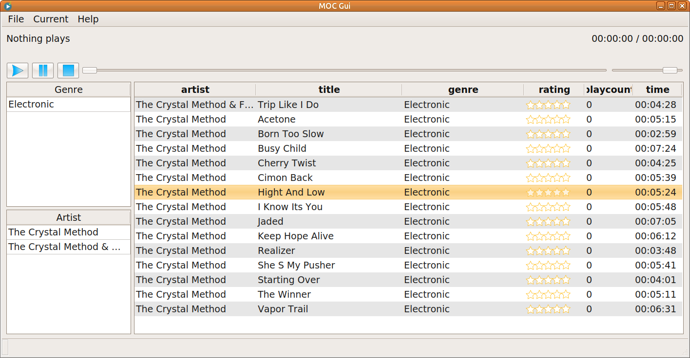

# MOCP Gui

Simple GUI for player [MOC](http://moc.daper.net/) writing in Qt C++/C.

For play using function playit of mocp.

```
 -l, --playit

              Play files given on the command line without modifying the clients' playlists.
```



### Dependencies

 - qt 5.x
 - mocp
 - mediainfo
 - sqlite3

### Other

Now support play only mp3.

(C) TechnoMag 2024


